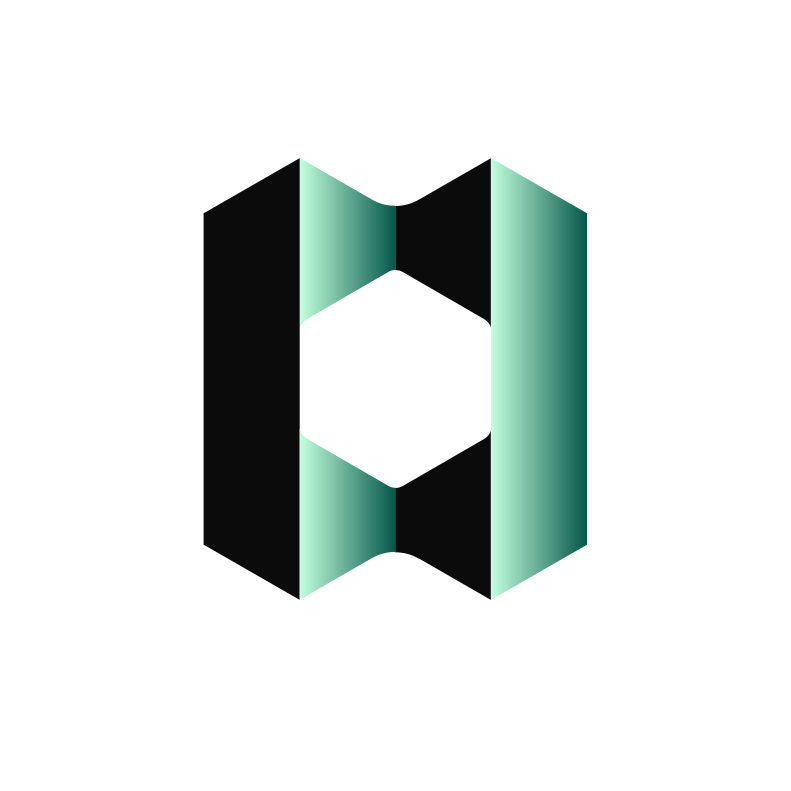

  

# Provenance Blockchain

[Provenance Blockchain][provenance] is an eco-friendly proof-of-stake (PoS) blockchain purpose built to modernize financial services, and the Provenance app is the core application for running a node in the network.

Provenance Blockchain is open-source with purpose-built capabilities leveraging the [CometBFT](https://docs.cometbft.com) (formerly Tendermint) consensus engine and [Cosmos SDK][cosmos]. Combined, this complete financial services infrastructure makes it safer, easier, cheaper, and faster to build and manage financial products and services.

For more information on the many TradFi institutions and Fintechs leveraging the Provenance Blockchain ecosystem, and to learn more about the Provenance Blockchain Foundation, visit [https://provenance.io][provenance].

## Status

[![Latest Release][release-badge]][release-latest]
[![Apache 2.0 License][license-badge]][license-url]
[![Go Report][goreport-badge]][goreport-url]
[![Code Coverage][cover-badge]][cover-report]
[![LOC][loc-badge]][loc-report]
![Lint Status][lint-badge]

[license-badge]: https://img.shields.io/github/license/provenance-io/provenance.svg
[license-url]: https://github.com/provenance-io/provenance/blob/main/LICENSE
[release-badge]: https://img.shields.io/github/tag/provenance-io/provenance.svg
[release-latest]: https://github.com/provenance-io/provenance/releases/latest
[goreport-badge]: https://goreportcard.com/badge/github.com/provenance-io/provenance
[goreport-url]: https://goreportcard.com/report/github.com/provenance-io/provenance
[cover-badge]: https://codecov.io/gh/provenance-io/provenance/branch/main/graph/badge.svg
[cover-report]: https://codecov.io/gh/provenance-io/provenance
[loc-badge]: https://tokei.rs/b1/github/provenance-io/provenance
[loc-report]: https://github.com/provenance-io/provenance
[lint-badge]: https://github.com/provenance-io/provenance/workflows/Lint/badge.svg
[provenance]: https://provenance.io/
[cosmos]: https://cosmos.network/

## Quick Start

As the [Provenance Blockchain][provenance] and its core modules are based on the [Cosmos SDK][cosmos], [this introduction](https://docs.cosmos.network/v0.47/learn/intro/overview) into Cosmos is a useful starting point.

Developers can use a local checkout and the make targets `make run` and `make localnet-start` to run a local development network.

Note: Requires [Go 1.23](https://golang.org/dl/) (specifically).

See Also: [Building](docs/Building.md)

## Active Networks

There are two active public Provenance networks, [testnet](https://github.com/provenance-io/testnet) and [mainnet](https://github.com/provenance-io/mainnet).
