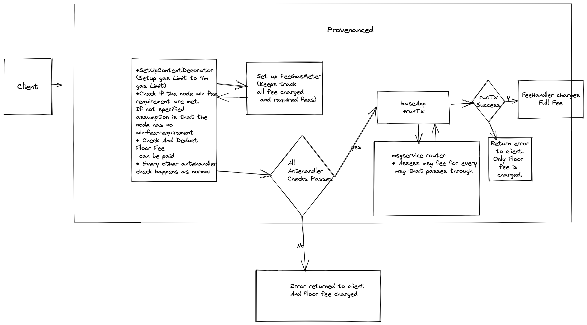

# ADR 001: No gas fees

## Changelog

- 2022-11-26: Initial Draft

## Status

Initial research

## Context
Get rid of gas as a construct in provenance blockchain, and only keep the fee construct.
Gas was a means to put a limit on the system, we should still set it to 
a max threshold value internally(4million same as the upper thresh hold for now).

We think it will really make client interaction simpler if there was only fee to deal with, in proposing tx's to the provenance blockchain and to get rid of the gas construct.
So Proposal is to get rid of gas as a construct in provenance blockchain, and only keep the fee construct.
Gas was a means to put a limit on the system, we should still set it(within the provenance software) as having a max threshold value but clients need not set it and also pay fees based on it. 
i.e if messages which exceed max threshold(currently 4 million) will still fail so as to protect the system.
Fees will be set using MsgFee module per message, for messages which are not in the list will be charged a default fee(to be decided).
See disadvantages section also for downside to this system.


### Tendermint considerations
Tendermint does use gas limits for certain checks, so we cannot blindly set an upper threshold when the state is passed to tendermint.
```go
// addNewTransaction handles the ABCI CheckTx response for the first time a
// transaction is added to the mempool.  A recheck after a block is committed
// goes to handleRecheckResult.
//
// If either the application rejected the transaction or a post-check hook is
// defined and rejects the transaction, it is discarded.
//
// Otherwise, if the mempool is full, check for lower-priority transactions
// that can be evicted to make room for the new one. If no such transactions
// exist, this transaction is logged and dropped; otherwise the selected
// transactions are evicted.
//
// Finally, the new transaction is added and size stats updated.
func (txmp *TxMempool) addNewTransaction(wtx *WrappedTx, checkTxRes *abci.ResponseCheckTx) {
```

```go
	wtx.SetGasWanted(checkTxRes.GasWanted)
	wtx.SetPriority(priority)
	wtx.SetSender(sender)
	txmp.insertTx(wtx)
```

Proposal

1. Ignore the min-gas-price set in `app.toml` and instead read a custom provenance file with (custom.toml)
```
[custom-node]
fees = "{n}nhash"
## minimum fee that a node will accept.
```
This is optional and will be set as 0 if not provided.

Check this value in `MinFeePricesDecorator`, it still keeps the 
semantics of a node not accepting transactions that are below it's minimum fee threshhold.
```go
minimumNodeFee := cast.ToString(appOpts.Get(fmt.Sprintf("%s.%s", "custom-node", "fees")))

	// If the node has a minimum fee it charges, then set it in config,else set 0nhash
	if fee, err := sdk.ParseCoinNormalized(minimumNodeFee); err == nil {
		pioconfig.SetMinimumNodeFee(fee)
	} else {
		pioconfig.SetMinimumNodeFee(sdk.Coin{
			Denom:  pioconfig.GetProvenanceConfig().FeeDenom,
			Amount: sdk.NewInt(0),
		})
	}
```
2. Add two params to msgfees module to account for a base fee charged to prevent spam and failed tx's and fee charged if no entry present in fee table
   (i.e default fee) detailed below.

Two new params added to msgfee module params, `floor_fee` and `default_msg_fee`
```
// constant to be used to charge a minimum fee for each transaction. for e.g 0.381 hash (1905nhash * 200000) 200k gas,
// is the default gas set by the cli. This will be the fee to be charged for spam prevention and failed tx's.
cosmos.base.v1beta1.Coin floor_fee = 5 [(gogoproto.nullable) = false];
```
and

```
// since gas is not used for fees anymore, the design should accommodate a fee that should be charged if no entry is present
// in the fee table, should be >= floor_fee, this is charged only on successful transactions
cosmos.base.v1beta1.Coin default_msg_fee = 6 [(gogoproto.nullable) = false];
```

3. Floor fee also replace the on chain `floor_gas_price` and that should be deprecated.
   `ProvenanceDeductFeeDecorator` will now deduct the floor fee for each transaction. Should probably be moved up in order if required.

4. All clients only pass in fee required(got from simulating the transaction via provenance simulate endpoint)


5. Clients can simulate the fee from the provenance simulation endpoint. Proposal would be to remove the gas from the response from this endpoint, so that clients 
break, but i am also ok with us deprecating it.
I believe we could also change the cosmos sim endpoint to return same response.(i.e fee required).
We should still keep a gas measurement endpoint which may be useful for operators of the chain to compare fees for different messages(/transactions)


6. Change the `NewSetUpContextDecorator` to take in a function to calculate a gas limit specific for provenance
```go
type GasLimit struct {
	Limit         uint64
	LimitFn       sdk.GasLimitHandler
	OverrideGasTx bool
}

// SetUpContextDecorator sets the GasMeter in the Context and wraps the next AnteHandler with a defer clause
// to recover from any downstream OutOfGas panics in the AnteHandler chain to return an error with information
// on gas provided and gas used.
// CONTRACT: Must be first decorator in the chain
// CONTRACT: Tx must implement GasTx interface
type SetUpContextDecorator struct{ gasLimit GasLimit }

func NewSetUpContextDecorator(gasLimit GasLimit) SetUpContextDecorator {
	return SetUpContextDecorator{gasLimit: gasLimit}
}
```

and apply it to the `tx` , right now the default limit is 4m gas with increasing them to 40m gas for Gov Messages and local-net.
```go
cosmosante.NewSetUpContextDecorator(cosmosante.GasLimit{
      Limit:         gasTxLimit,
      OverrideGasTx: true,
      LimitFn: func(ctx sdk.Context, tx sdk.Tx, defaultGasLimit uint64) (actualGasLimit uint64, err error) {
      maxGasLimit := ctx.ConsensusParams().Block.GetMaxGas()
      // If consensus_params.block.max_gas is set to -1, ignore gasTxLimit. This is to allow for testing on local nodes
      // since mainnet and testnet have block level limit set.
      if maxGasLimit == -1 {
      // choosing a very high multiplier
      return gasTxLimit * 10, nil
      }
      //if test context or gov messages then set to block limit of gas, should be a reasonable max i think.
      if isTestContext(ctx) && isOnlyGovMsgs(tx.GetMsgs()) {
      return gasTxLimit * 10, nil
      }
      return gasTxLimit, nil
      },
})
```

additional flag `OverrideGasTx` is just not to have the cosmos-sdk tests fail and will continue to apply the tx gas limit for that project,
instead of the overridden value for `provenanced`.

In the cosmos-sdk 
```go
	if sud.gasLimit.OverrideGasTx {
		actualGasLimit, errFromGasLimitFn := sud.gasLimit.LimitFn(ctx, tx, sud.gasLimit.Limit)
		if errFromGasLimitFn != nil {
			return ctx, errFromGasLimitFn
		}
		newCtx = SetGasMeter(simulate, ctx, actualGasLimit)
	} else {
		newCtx = SetGasMeter(simulate, ctx, gasTx.GetGas())
	}
```


for context this is the code currently in cosmos-sdk, i.e the client passed in gas limit would be applied
```go
newCtx = SetGasMeter(simulate, ctx, gasTx.GetGas())
```

so sim tests etc in the cosmos-sdk will continue to behave as it does now.

5. The limit being set to 4m initially, is interesting because this now will fill up blocks faster because the limit is set so much higher, 
to avoid this we set the gas limit == gas consumed at the end of each `runTx` method in baseapp.go
```go
// runTx processes a transaction within a given execution mode, encoded transaction
// bytes, and the decoded transaction itself. All state transitions occur through
// a cached Context depending on the mode provided. State only gets persisted
// if all messages get executed successfully and the execution mode is DeliverTx.
// Note, gas execution info is always returned. A reference to a Result is
// returned if the tx does not run out of gas and if all the messages are valid
// and execute successfully. An error is returned otherwise.
func (app *BaseApp) runTx(mode runTxMode, txBytes []byte) (gInfo sdk.GasInfo, result *sdk.Result, anteEvents []abci.Event, priority int64, txCtx sdk.Context, err error) 
```
* Any standard tx is 4million gas set up by the Antehandler. 
* no changes need to happen the gas meters, except that when we run the messages in `baseapp.go` we set the limit to gas consumed,
this keeps the tendermint check for maxBytes of a block
and what can be included in a block in line(or close to) to current scenario where the user estimates gas.

What we need in the baseapp is only this.
```go
	// GasMeter expected to be set in AnteHandler
	// however provenance will depend on message fees and should match up to just gas consumed
	gasWanted = ctx.GasMeter().GasConsumed()

	return gInfo, result, anteEvents, priority, ctx, err
```


6. If a Tx fails because of running out of gas even at 4m (or whatever the max threshold is defined or 40m for gov messages.)
then we take the floor fees provided. and it still fails with out of gas.

7. All normal failed tx's get charged floor fees.

8. Fee table is to be set up as params in the msg fee module which already exists.

9. Fee checks are already assessed in msgservicerouter for additional fees, 
 but it will to be augmented for `default_msg_fee` if a fee is not present for a particular message.
10. wasm module also go through the same checks in msgservicerouter so should behave the same.
taking the example of a `wasm execute` then
 * execute msg will have a fee (ideally we should set a sane amount for a typical execute, since contracts on provenance only are uploaded by gov and already maybe paying extra fee within the contract, this value should probably be low.). 
 * any sub message dispatched will also be charged a fee (a default fee if not in fee table)
important to call out that smart contracts that existing gas limit that wasmd enforces like `queryGasLimit` will still apply.

```go
// queryGasLimit is the max wasmvm gas that can be spent on executing a query with a contract
   queryGasLimit        uint64
   paramSpace           paramtypes.Subspace
   gasRegister          GasRegister
   maxQueryStackSize    uint32
```

wasmd makes certain assumptions on certain core operations, for this fee only implementation we should set the fee table for these messages at the very least e.g `MsgStoreCode`, `MsgInstantiateContract` etc
see details here for more information on these defaults
https://github.com/notional-labs/wasmd/blob/e714fdf3b44a93462232648ab670ff611c381ce1/x/wasm/keeper/gas_register.go#L34

11. Client will have to use the provenance `simulation` endpoint which will also need to augmented to support ``default_msg_fee` if message is not present in the 
fee table.


### Advantages:
1.Fee system will become more transparent and predictable.
2.Gas always causes confusion for client side developers.

### Disadvantages
1. Gas concept does makes differentiating between transactions which take up more computing resources vs which take up less. This is even more pronounced in samrt contracts
which could vary wildly in terms of what they do internally, even though dispatched sub messages will cause the more complex smart contract to be more expensive, but some
of the wasmd charges for gas on certain operation is negated, classic example being where wasmd charges a gas for each emitted event etc 

```go
// EventPerAttributeCost is how much SDK gas is charged *per byte* for attribute data in events.
	// This is used with len(key) + len(value)
	EventPerAttributeCost sdk.Gas
```

### Unknowns
Tracing through the wasmd call it seems to convert between wasm gas vs sdk gas  for calls to the wasmvm like here https://github.com/notional-labs/wasmd/blob/9c5ebbbc4ca58053c633742f75503d231ef904bf/x/wasm/keeper/keeper.go#L421 && https://github.com/notional-labs/wasmd/blob/2390ea15a0da70398c42d49d5d98515b75f49297/x/wasm/types/wasmer_engine.go#L57
```go
// ToWasmVMGas convert to wasmVM contract runtime gas unit
func (g WasmGasRegister) ToWasmVMGas(source storetypes.Gas) uint64 {
	x := source * g.c.GasMultiplier
	if x < source {
		panic(sdk.ErrorOutOfGas{Descriptor: "overflow"})
	}
	return x
}
```
in my opinion these still hold for the proposed system ^^.


