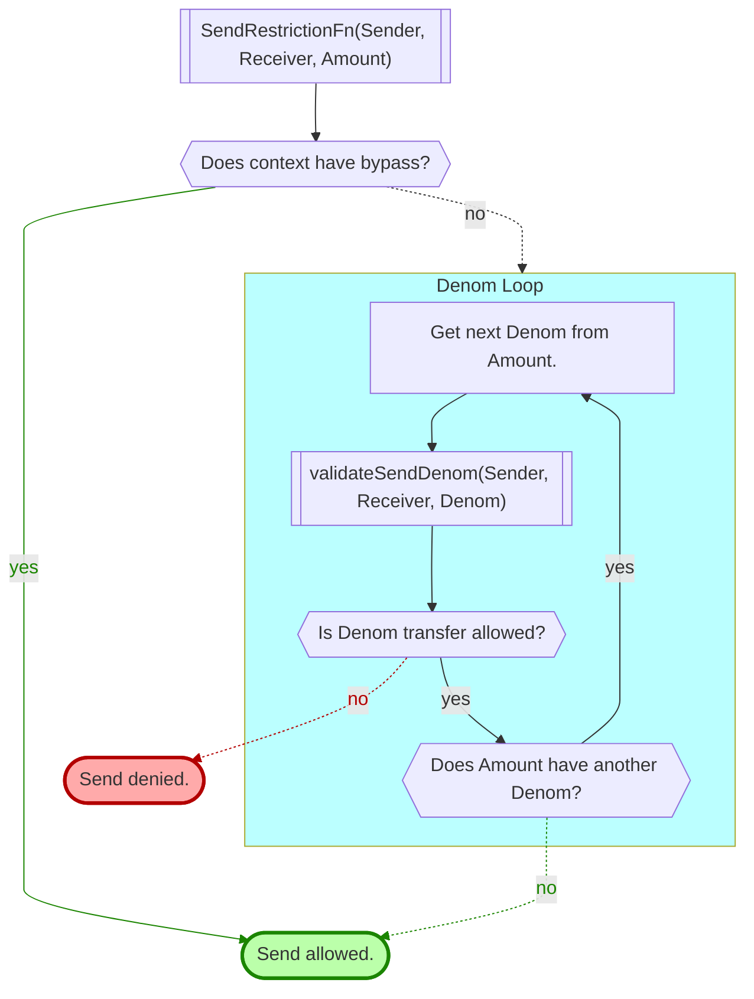
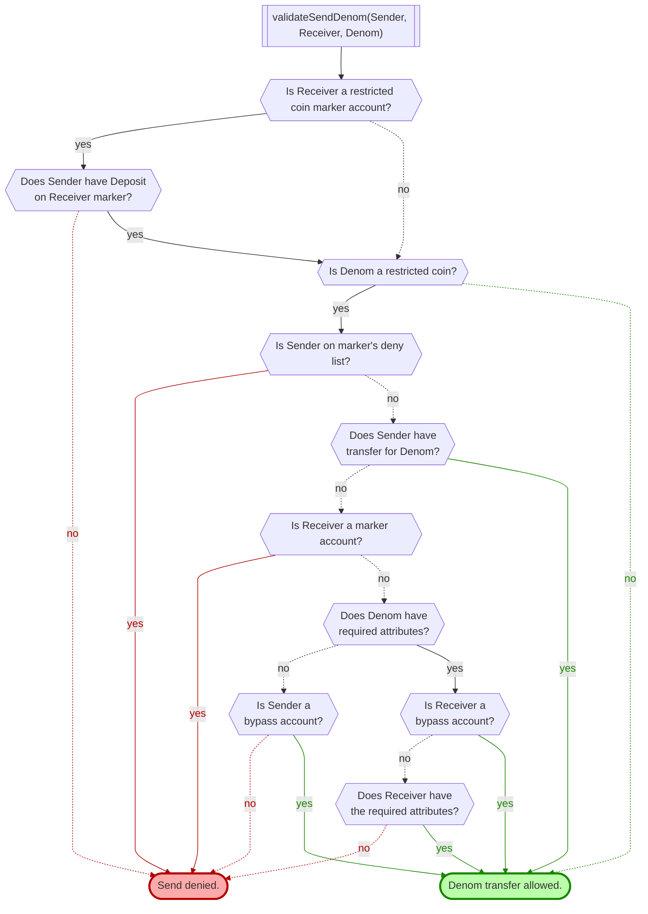
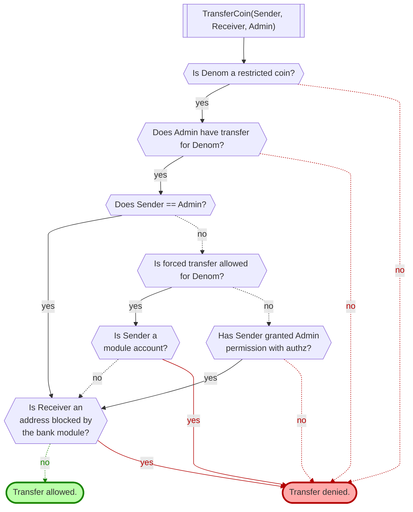
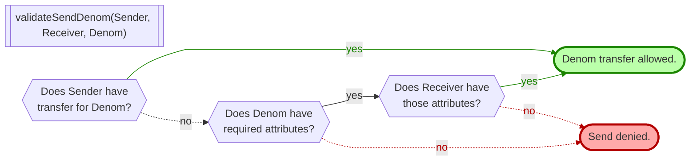
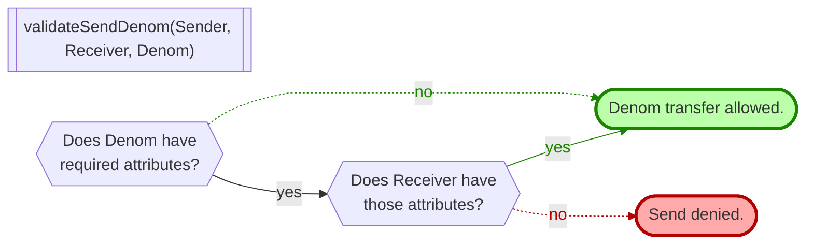
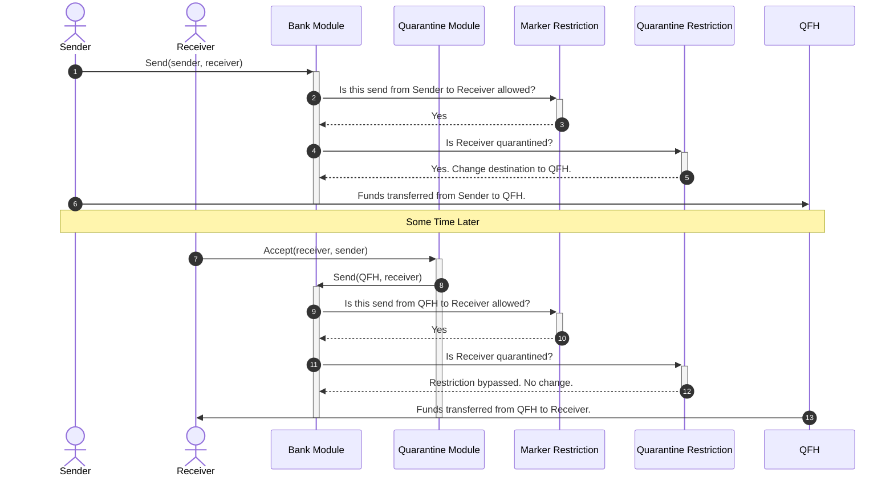

# Transfers

There are some complex interactions involved with transfers of restricted coins.

<!-- TOC -->
  - [General](#general)
  - [Definitions](#definitions)
    - [Transfer Permission](#transfer-permission)
    - [Forced Transfers](#forced-transfers)
    - [Required Attributes](#required-attributes)
    - [Individuality](#individuality)
    - [Deposits](#deposits)
    - [Bypass Accounts](#bypass-accounts)
  - [Send Restrictions](#send-restrictions)
    - [Flowcharts](#flowcharts)
    - [Quarantine Complexities](#quarantine-complexities)

## General

Accounting of restricted coins is handled by the bank module. Restricted funds can be moved using the bank module's `MsgSend` or `MsgMutliSend`. They can also be moved using the marker module's `MsgTransferRequest`.

During such transfers several things are checked using a `SendRestrictionFn` injected into the bank module. This restriction is applied in almost all instances when funds are being moved between accounts. The exceptions are delegations, undelegations, minting, burning, and marker withdrawals. A `MsgTransferRequest` also bypasses the `SendRestrictionFn` in order to include the `admin` account in the logic.

<!-- TODO: Add notes about IBC movement too -->

## Definitions

### Transfer Permission

One permission that can be granted to an address is `transfer`.  The `transfer` permission is granted to accounts that represent a "Transfer Agent" or "Transfer Authority" for restricted marker tokens. An address with `transfer` permission can utilize `MsgTransferRequest` to move restricted funds from one account to another. If the marker allows forced transfer, the source account can be any account, otherwise, it must be the admin's own account.

`MsgSend` and `MsgMultiSend` can also be used by an address with `transfer` permission to move funds out of their own account.

### Forced Transfers

A restricted coin marker can be configured to allow forced transfers. If allowed, an account with `transfer` permission can use a `MsgTransferRequest` to transfer the restricted coins out of almost any account to another. Forced transfer cannot be used to move restricted coins out of module accounts or smart contract accounts, though.

### Required Attributes

Required attributes allow a marker Transfer Authority to define a set of account attestations created with the name/attribute modules to certify an account as an approved holder of the token.  Accounts that possess all of the required attributes are considered authorized by the Transfer Authority to receive the token from normal bank send operations without a specific Transfer Authority approval. Required attributes are only supported on restricted markers.

For example, say account A has some restricted coins of a marker that has required attributes. Also say account B has all of those required attributes, and account C does not. Account A could use a `MsgSend` to send those restricted coins to account B. However, account B could not send them to account C (unless B also has `transfer` permission).

If a restricted coin marker does not have any required attributes defined, the only way the funds can be moved is by someone with `transfer` permisison.

### Individuality

If multiple restricted coin denoms are being moved at once, each denom is considered separately.
For example, if the sender has `transfer` permission on one of them, it does not also apply to the other(s).

### Deposits

A deposit is when any funds are being sent to a marker's account. The funds being sent do not have to be in the denom of the destination marker.

Whenever funds are being deposited into a marker, the sender must have `deposit` permission on the target marker. If the funds to deposit are restricted coins, the sender also needs `transfer` permission on the funds being moved; required attributes are not taken into account.

### Bypass Accounts

There are several hard-coded module account addresses that are given special consideration in the marker module's `SendRestrictionFn`:

* `authtypes.FeeCollectorName` - Allows paying fees with restricted coins.
* `reward` - Allows reward programs to use restricted coins.
* `quarantine` - Allows quarantine and acceptance of quarantined coins.
* `gov` - Allows deposits to have quarantined coins.
* `distribution` - Allows collection of delegation rewards in restricted coins.
* `stakingtypes.BondedPoolName` - Allows delegation of restricted coins.
* `stakingtypes.NotBondedPoolName` - Allows delegation of restricted coins.

All of these are treated equally in the application of a marker's send restrictions.

For restricted markers without required attributes:
* If the `toAddr` is a bypass account, the `fromAddr` must have transfer authority.
* If the `fromAddr` is a bypass account, it's assumed that the funds got where they currently are because someone with transfer authority got them there, so this transfer is allowed.

For restricted markers with required attributes:
* If the `toAddr` is a bypass account, the transfer is allowed regardless of whether the `fromAddr` has transfer authority. It's assumed that the next destination's attributes will be properly checked before allowing the funds to leave the bypass account.
* If the `fromAddr` is a bypass account, the `toAddr` must have the required attributes.

Bypass accounts are not considered during a `MsgTransferRequest`.

## Send Restrictions

The marker module injects a `SendRestrictionFn` into the bank module. This function is responsible for deciding whether any given transfer is allowed from the marker module's point of view. However, it is bypassed during a `MsgTransfer`.

### Flowcharts

#### The SendRestrictionFn

This `SendRestrictionFn` uses the following flow.

#### validateSendDenom

Each `Denom` is checked using `validateSendDenom`, which has this flow:

#### MsgTransferRequest

A `MsgTransferRequest` bypasses the `SendRestrictionFn` and applies its own logic. A `MsgTransferRequest` only allows for a single coin amount, i.e. there's only one `Denom` to consider.

### Quarantine Complexities

There are some noteable complexities involving restricted coins and quarantined accounts.

#### Sending Restricted Coins to a Quarantined Account

The marker module's `SendRestrictionFn` is applied before the quarantine module's. So, when funds are being sent to a quarantined account, the marker module runs its check using the original `Sender` and `Receiver` (i.e. the `Receiver` is not `QFH`).

If the `Receiver` is a quarantined account, we can assume that it is neither a marker, nor a bypass account. Then, assuming the `Sender` is not on the deny list, the `validateSendDenom` flow can be simplified to this for restricted coins.

If the `Send` is allowed, and the `Receiver` is a quarantined account, the quarantine module's `SendRestrictionFn` will then change the `Send`'s destination to `QFH` (the Quarantined-funds-holder account) and make a record of the transfer. The `Send` then transfers funds from the `Sender` to `QFH`.

The marker's `SendRestrictionFn` should never have `QFH` as a `Receiver`. The only way this would happen is if `MsgSend` is used to send funds directly to `QFH`.

If `MsgTransferRequest` is used to transfer a restricted coin to a quarantined account, the standard `MsgTransferRequest` logic is applied (bypassing the marker module's `SendRestrictionFn`). The quarantine module's `SendRestrictionFn` is not bypassed, though, so the funds still go to the `QFH`.

#### Accepting Quarantined Restricted Coins

Once funds have been sent to `QFH`, the `Receiver` will probably want to accept them, and have them sent to their account. They issue an `Accept` to the quarantine module which utilizes the bank module's `Send` functionality to try to transfer funds from `QFH` to the `Receiver`.

`QFH` is a bypass account. Since `Receiver` is a quarantined account, we can assume that it is neither a marker nor bypass account. So, the `validateSendDenom` flow can be simplified to this for restricted coins.

If the `Send` is allowed, the requested funds are transferred from `QFH` to `Receiver`.

If the `Send` is denied, the funds remain with `QFH`.

An important subtle part of this process is the rechecking of `Receiver` attributes. It's possible for the initial send to be okay (causing funds to be quarantined), then later, during this `Accept`, the send is not okay, and the quarantined funds are effectively locked with`QFH` until the `Receiver` gets the required attributes.

If the marker does not have required attributes though, it's assumed that they were originally sent by someone with transfer authority, so they are allowed to continue from here too.

#### Successful Quarantine and Accept Sequence

When restricted coin funds are sent to a quarantined account (1), the marker's `SendRestrictionFn` is called using the original `Sender` and `Receiver` (2). Then, the quarantine's `SendRestrictionFn` is called (4) which will return `QFH` for the new destination (5). Funds are then transferred from `Sender` to `QFH` (6).

When the `Receiver` attempts to `Accept` those quarantined funds (7), the marker's `SendRestrictionFn` is called again, this time using `QFH` (as the sender) and `Receiver` (9). The quarantine's `SendRestrictionFn` is bypassed (11), so the destination is not changed (12). Funds are then transferred from `QFH` to `Receiver` (13).

