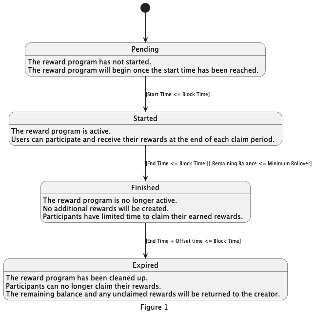
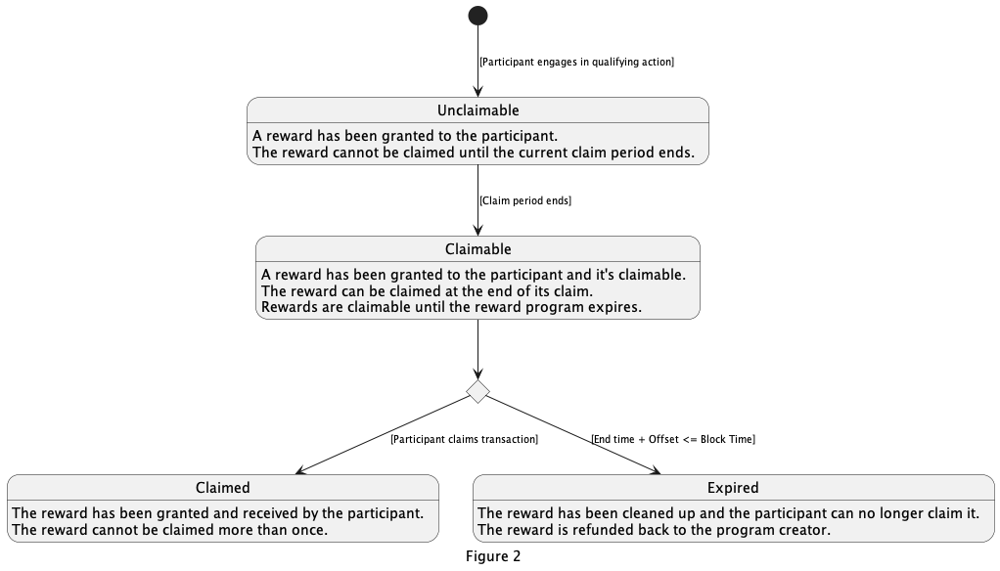

<!--
order: 3
-->

# State Transitions

This document describes the state transition operations involved in the rewards module.

<!-- TOC -->
  - [Reward Programs](#reward-programs)
    - [Pending ](#pending)
    - [Started ](#started)
    - [Finished ](#finished)
    - [Expired](#expired)
  - [Reward Claims](#reward-claims)
    - [Unclaimable](#unclaimable)
    - [Claimable](#claimable)
    - [Claimed](#claimed)
    - [Expired](#expired)

## Reward Programs
State transition for Reward Programs happen on `BeginBlock` and make use of the `BlockTime` attribute.

A Reward Program can be `Pending`, `Started`, `Finished`, or `Expired`. A Reward Program will move through all these states, and will initially be in the `Pending` state.

#### Note
A Reward Program creator may end a Reward Program early while it's in `Pending` or `Started` state. A Reward Program in the `Pending` state will be deleted and not progress through all the states. Any program that is ended after it's in the `Started` state will transition to the `Finished` state on the next `BeginBlock`.

### Pending
Reward program has *not* started.

#### Note
A user may force a Reward Program in this state to end with the `end-reward-program` transaction. In this case the Reward Program will be deleted and not progress.

### Started
The Reward Program has started, and users can participate by performing qualifying actions. Participants can claim their rewards at the end of the claim period that the qualifying action was performed in.

#### Note
A user may force a Reward Program in this state to end with the `end-reward-program` transaction. The Reward Program will transition to the `Finished` state on the next `BeginBlock`.

### Finished
The Reward Program has ended, and participants can no longer make qualifying actions. Participants have a limited amount of time to collect their remaining rewards.

### Expired
Reward program has passed its expiration date, and participants can no longer claim rewards. The remaining balance and any unclaimed rewards will be returned to the creator.

  

## Reward Claims
State transitions for a Reward Claim happen on `BeginBlock` and on claim transactions.

A Reward Claim can be `Unclaimable`, `Claimable`, `Claimed`, or `Expired`. A Reward Claim will always start as `Unclaimable` and eventually become `Claimable`. If a participant claims their reward then the Reward Claim will become `Claimed`, otherwise it will timeout and enter the `Expired` state where they can no longer claim it.

### Unclaimable
The reward has been granted to a participant, but it cannot be claimed until the current claim period ends.

### Claimable
The reward has been granted to the participant, and it's claimable by the participant via a transaction. If the reward is not claimed it will eventually expire.

### Claimed
The reward has been granted and received by the participant. A reward cannot be claimed more than once.

### Expired
The reward has been cleaned up and the participant can no longer claim it. The funds attached to the reward claim are refunded back to the program creator.

  

