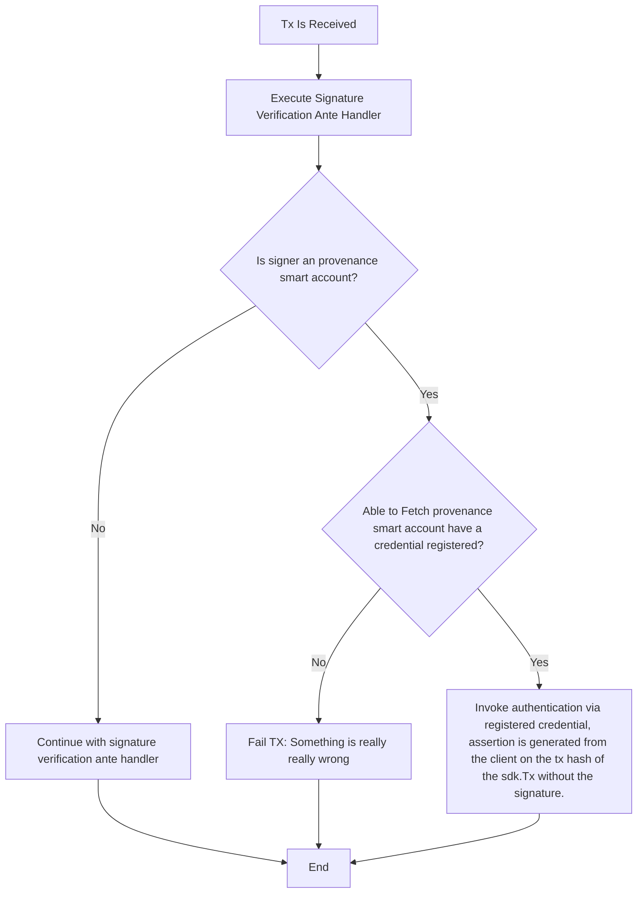

<!--
order: 2
-->

# State

[Provenance Smart Account](../../../proto/provenance/smartaccount/v1/provenanceaccount.proto)
```protobuf
syntax = "proto3";

package provenance.smartaccounts.v1;

option go_package = "github.com/provenance-io/provenance/x/smartaccounts/types";

import "google/protobuf/any.proto";
import "cosmos/msg/v1/msg.proto";
import "cosmos/base/v1beta1/coin.proto";
import "gogoproto/gogo.proto";
// MsgInit is used to initialize a provenance account.
message MsgInit {
  // if we pull in x/accounts this field can go away
  option (cosmos.msg.v1.signer) = "sender";

  // sender is the address of the sender of this message.
  // if we pull in x/accounts this field can go away
  string sender = 1;
  // account_type is the type of the account to be created.
  // if we pull in x/accounts this field can go away
  string account_type = 2;

  // address_seed can be used to deterministically create the address of the account.
  // If not present the address will be generated based on its associated account number.
  // if we pull in x/accounts this field can go away
  bytes address_seed = 4;

  // pub_key defines a pubkey for the account arbitrary encapsulated.
  google.protobuf.Any pub_key = 5;
  // init_sequence defines the initial sequence of the account.
  // Defaults to zero if not set.
  uint64 init_sequence = 6;
  // list of credential types supported by the account
  repeated Credential credentials = 7;
}

// MsgInitResponse is the response returned after smart account initialization.
// For now, This is empty.
message MsgInitResponse {
  // account_address is the address of the newly created account.
  string account_address = 1;
}

// Enum for credential type
enum CredentialType {
  // Unspecified credential type
  CREDENTIAL_TYPE_UNSPECIFIED = 0;
  // ED25519 credential type
  CREDENTIAL_TYPE_ED25519 = 1;
  // Invite credential type
  CREDENTIAL_TYPE_INVITE = 2;
  // K256 credential type
  CREDENTIAL_TYPE_K256 = 3;
  // P256 credential type
  CREDENTIAL_TYPE_P256 = 4;
  // WebAuthn credential type
  CREDENTIAL_TYPE_WEBAUTHN = 5;
  // WebAuthn with UV credential type
  CREDENTIAL_TYPE_WEBAUTHN_UV = 6;
}

// Credential message
message Credential {
  string id = 1 ;
  // do we want hex bytes here?
  google.protobuf.Any public_key = 2;
  string username = 3 ;
  CredentialType variant = 4;
  bytes raw_id = 5;
  bytes aaguid = 6;
}

// MsgSwapPubKey is used to change the pubkey for the account.
message MsgSwapPubKey {
  // new_pub_key defines the secp256k1 pubkey to swap the account to.
  google.protobuf.Any new_pub_key = 1;
}

// MsgSwapPubKeyResponse is the response for the MsgSwapPubKey message.
// This is empty.
message MsgSwapPubKeyResponse {}

// QuerySequence is the request for the account sequence.
message QuerySequence {}

// QuerySequenceResponse returns the sequence of the account.
message QuerySequenceResponse {
  // sequence is the current sequence of the account.
  uint64 sequence = 1;
}

// QueryPubKey is the request used to query the pubkey of an account.
message QueryPubKey {}

// QueryPubKeyResponse is the response returned when a QueryPubKey message is sent.
message QueryPubKeyResponse {
  google.protobuf.Any pub_key = 1;
}


```



