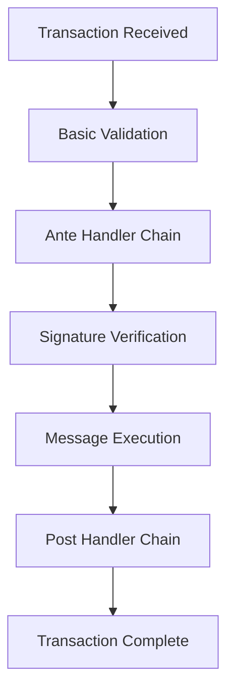
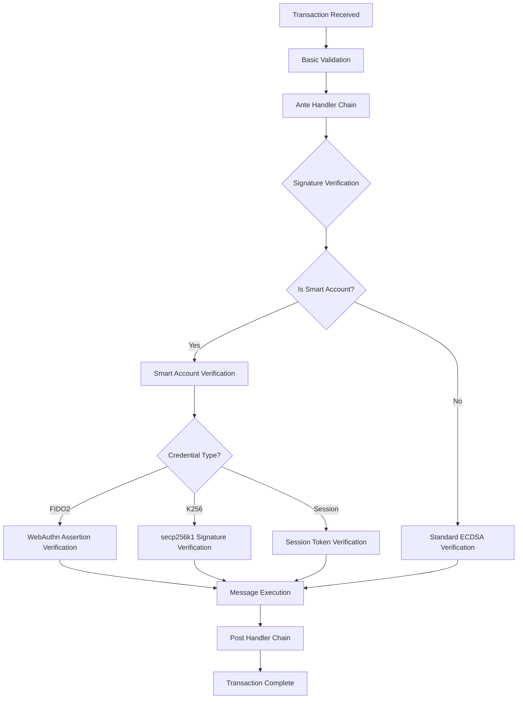

<!--
order: 7
-->

# Authentication Flow

The smart accounts module integrates with Cosmos SDK's transaction processing pipeline to provide flexible authentication methods. This document describes how authentication works for smart accounts and how it differs from traditional account authentication.

## Overview

Smart accounts extend the standard Cosmos SDK authentication mechanism by:
- Supporting multiple credential types per account
- Implementing custom signature verification logic
- Maintaining backward compatibility with traditional accounts
- Providing seamless integration with existing applications

## Transaction Processing Pipeline

### Standard Cosmos SDK Flow



### Smart Account Integration

The smart accounts module integrates into the signature verification step:



## Authentication Methods

### Traditional Account Authentication

For standard Cosmos SDK accounts:
1. Extract public key from signature
2. Verify ECDSA signature against transaction bytes
3. Check signature matches account's stored public key
4. Validate account sequence number

### Smart Account Authentication

For smart accounts, authentication depends on the credential type used:

#### FIDO2/WebAuthn Authentication

**Process:**
1. Client creates WebAuthn assertion using authenticator
2. Assertion includes signature over transaction hash
3. Module verifies assertion against stored credential
4. Validation includes origin binding and user verification

**Assertion Structure:**
```json
{
  "id": "credential-id-base64",
  "rawId": "credential-id-binary",
  "type": "public-key",
  "response": {
    "clientDataJSON": "base64-encoded-client-data",
    "authenticatorData": "base64-encoded-auth-data",
    "signature": "base64-encoded-signature",
    "userHandle": "base64-encoded-user-id"
  }
}
```

**Verification Steps:**
1. Parse and validate assertion structure
2. Verify client data JSON contains correct challenge (transaction hash)
3. Validate authenticator data structure and flags
4. Reconstruct signed data from client data and authenticator data
5. Verify signature using stored public key
6. Check credential ID matches registered credential

#### Traditional Cryptographic Authentication

**secp256k1 (K256) Credentials:**
- Standard ECDSA signature verification
- Same process as regular Cosmos SDK accounts
- Public key must match registered credential

**Ed25519 Credentials:**
- Edwards curve signature verification
- High performance and security
- Compact signature size

**P256 Credentials:**
- NIST P-256 curve signature verification
- Hardware security module compatibility
- Enterprise-grade cryptography

#### Session-Based Authentication (Future)

**Temporary Credentials:**
- Short-lived authentication tokens
- Block height-based expiration
- Reduced friction for frequent transactions

## Challenge Generation

### Transaction Hash as Challenge

For all authentication methods, the challenge is derived from transaction data:

```go
// Pseudo-code for challenge generation
func GenerateChallenge(tx sdk.Tx) []byte {
    // Remove signatures from transaction
    unsignedTx := RemoveSignatures(tx)
    
    // Create canonical transaction bytes
    txBytes := CreateCanonicalBytes(unsignedTx)
    
    // Hash the transaction bytes
    challenge := sha256.Sum256(txBytes)
    
    return challenge[:]
}
```

### FIDO2 Challenge Format

For WebAuthn credentials, the challenge is embedded in the client data:

```json
{
  "type": "webauthn.get",
  "challenge": "base64url-encoded-tx-hash",
  "origin": "https://wallet.provenance.io",
  "crossOrigin": false
}
```

## Signature Verification Process

### Ante Handler Integration

The smart accounts module provides an ante handler that integrates with the Cosmos SDK ante handler chain:

```go
func SmartAccountSignatureVerificationDecorator(ak AccountKeeper, saKeeper SmartAccountKeeper) sdk.AnteDecorator {
    return smartAccountSignatureVerificationDecorator{
        ak:       ak,
        saKeeper: saKeeper,
    }
}

func (sad smartAccountSignatureVerificationDecorator) AnteHandle(
    ctx sdk.Context,
    tx sdk.Tx,
    simulate bool,
    next sdk.AnteHandler,
) (newCtx sdk.Context, err error) {
    // Get signers from transaction
    signers := tx.GetSigners()
    
    for _, signer := range signers {
        account := sad.ak.GetAccount(ctx, signer)
        
        // Check if this is a smart account
        if smartAccount, ok := account.(*types.ProvenanceAccount); ok {
            err := sad.verifySmartAccountSignature(ctx, tx, smartAccount)
            if err != nil {
                return ctx, err
            }
        } else {
            // Use standard signature verification
            continue
        }
    }
    
    return next(ctx, tx, simulate)
}
```

### Multi-Signature Support

Smart accounts can support multi-signature scenarios:

**Single Credential Authentication:**
- Any registered credential can authenticate the transaction
- Most common use case for individual users
- Provides flexibility in device choice

**Multi-Credential Authentication (Future):**
- Require multiple credentials for high-value transactions
- Configurable threshold (e.g., 2 of 3 credentials)
- Enhanced security for institutional accounts

## Error Handling

### Authentication Failures

**Common Error Types:**

```go
var (
    ErrInvalidSignature          = errors.New("invalid signature")
    ErrCredentialNotFound        = errors.New("credential not found")
    ErrInvalidAssertion         = errors.New("invalid WebAuthn assertion")
    ErrChallengeMismatch        = errors.New("challenge does not match transaction")
    ErrOriginMismatch           = errors.New("origin does not match registered credential")
    ErrUserVerificationRequired = errors.New("user verification required but not provided")
)
```

**Error Recovery:**
- Failed authentication prevents transaction execution
- Clear error messages help users identify issues
- Retry with different credentials if available
- Fallback to traditional authentication if supported

### Debugging Authentication Issues

**Common Problems:**
1. **Challenge Mismatch**: Transaction hash doesn't match assertion challenge
2. **Origin Binding**: WebAuthn assertion from wrong origin
3. **Credential Not Found**: Using unregistered or deleted credential
4. **Signature Format**: Malformed signature or assertion data
5. **User Verification**: UV flag required but not provided

**Diagnostic Tools:**
- Transaction simulation with detailed error messages
- Credential validation endpoints
- Debug logging for signature verification process

## Security Considerations

### Replay Attack Prevention

**Nonce Mechanism:**
- Account sequence numbers prevent replay attacks
- Each transaction must have incrementing sequence
- Sequence validation occurs before signature verification

**Transaction Uniqueness:**
- Transaction hash includes all transaction data
- Signatures are bound to specific transaction content
- Cannot reuse signatures across different transactions

### Time-based Attacks

**Clock Skew Protection:**
- WebAuthn assertions include timestamp validation
- Reasonable time window for assertion validity
- Protection against delayed replay attacks

**Session Expiration:**
- Session-based credentials have strict time limits
- Block height-based expiration prevents long-term abuse
- Automatic cleanup of expired sessions

### Origin Binding (FIDO2)

**Domain Validation:**
- WebAuthn credentials are bound to specific origins
- Prevents cross-site signature abuse
- Enforced during both registration and authentication

**Relying Party ID:**
- Credentials store the RP ID used during registration
- Authentication must use the same RP ID
- Prevents credential use across different applications

## Performance Optimizations

### Signature Verification Costs

**Gas Metering:**
- Different credential types have different gas costs
- FIDO2 verification more expensive than secp256k1
- Gas costs reflect computational complexity

**Caching:**
- Public key extraction and validation can be cached
- Repeated signature verifications for same credential
- Balance memory usage with computation savings

### Parallel Processing

**Multiple Signers:**
- Independent signature verification for each signer
- Parallel processing where possible
- Early termination on first failure

## Integration Examples

### Client-Side Authentication

**JavaScript/TypeScript WebAuthn:**
```typescript
async function authenticateTransaction(tx: StdTx, credentialId: string): Promise<AuthenticationAssertion> {
    // Generate challenge from transaction
    const challenge = await generateTransactionChallenge(tx);
    
    // Create WebAuthn assertion
    const assertion = await navigator.credentials.get({
        publicKey: {
            challenge: challenge,
            allowCredentials: [{
                id: base64ToArrayBuffer(credentialId),
                type: 'public-key'
            }],
            userVerification: 'required'
        }
    }) as PublicKeyCredential;
    
    return {
        credentialId: credentialId,
        clientDataJSON: arrayBufferToBase64(assertion.response.clientDataJSON),
        authenticatorData: arrayBufferToBase64(assertion.response.authenticatorData),
        signature: arrayBufferToBase64(assertion.response.signature),
        userHandle: assertion.response.userHandle ? 
            arrayBufferToBase64(assertion.response.userHandle) : null
    };
}
```

**Traditional Signature:**
```typescript
async function signTransaction(tx: StdTx, privateKey: string): Promise<StdSignature> {
    const challenge = await generateTransactionChallenge(tx);
    const signature = await signChallenge(challenge, privateKey);
    
    return {
        signature: signature,
        pub_key: extractPublicKey(privateKey)
    };
}
```

### Server-Side Verification

**Go Implementation:**
```go
func (k Keeper) VerifySmartAccountSignature(
    ctx sdk.Context,
    tx sdk.Tx,
    account *types.ProvenanceAccount,
    signature []byte,
) error {
    // Generate challenge from transaction
    challenge := k.GenerateTransactionChallenge(tx)
    
    // Find matching credential
    for _, credential := range account.Credentials {
        if k.VerifyCredentialSignature(credential, challenge, signature) {
            return nil // Success
        }
    }
    
    return types.ErrInvalidSignature
}
```

## Testing Authentication

### Unit Tests

```go
func TestSmartAccountAuthentication(t *testing.T) {
    app := setupTestApp()
    ctx := app.BaseApp.NewContext(false, tmproto.Header{})
    
    // Create smart account with FIDO2 credential
    account := createTestSmartAccountWithFido2(ctx, app)
    
    // Create test transaction
    tx := createTestTransaction(account.GetAddress())
    
    // Generate valid WebAuthn assertion
    assertion := generateTestAssertion(tx, account.Credentials[0])
    
    // Test signature verification
    err := app.SmartAccountsKeeper.VerifySmartAccountSignature(
        ctx, tx, account, assertion,
    )
    require.NoError(t, err)
}
```

### Integration Tests

```bash
#!/bin/bash

# Test FIDO2 authentication flow
provenanced tx smartaccounts add-webauthn-credentials \
    --encodedAttestation "$ATTESTATION" \
    --user-identifier "test-user" \
    --from alice \
    --chain-id testing

# Test transaction with FIDO2 signature
provenanced tx bank send alice bob 1000stake \
    --webauthn-assertion "$ASSERTION" \
    --chain-id testing
```

## Future Enhancements

### Advanced Authentication Features

**Multi-Factor Authentication:**
- Require multiple credential types for sensitive operations
- Configurable authentication policies per account
- Risk-based authentication triggers

**Conditional Authentication:**
- Different requirements based on transaction type
- Amount-based authentication escalation
- Time-based authentication policies

**Biometric Integration:**
- Direct biometric signature verification
- Hardware security module integration
- Zero-knowledge proof authentication

### Performance Improvements

**Signature Aggregation:**
- Batch signature verification for multiple signers
- Cryptographic signature schemes supporting aggregation
- Reduced verification overhead for multi-sig transactions

**Hardware Acceleration:**
- Specialized hardware for cryptographic operations
- GPU acceleration for signature verification
- Custom ASICs for high-throughput scenarios