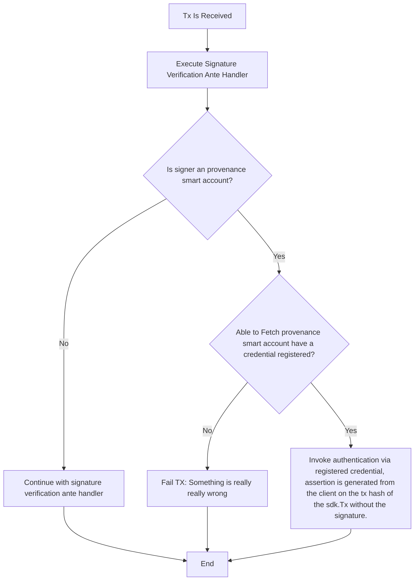
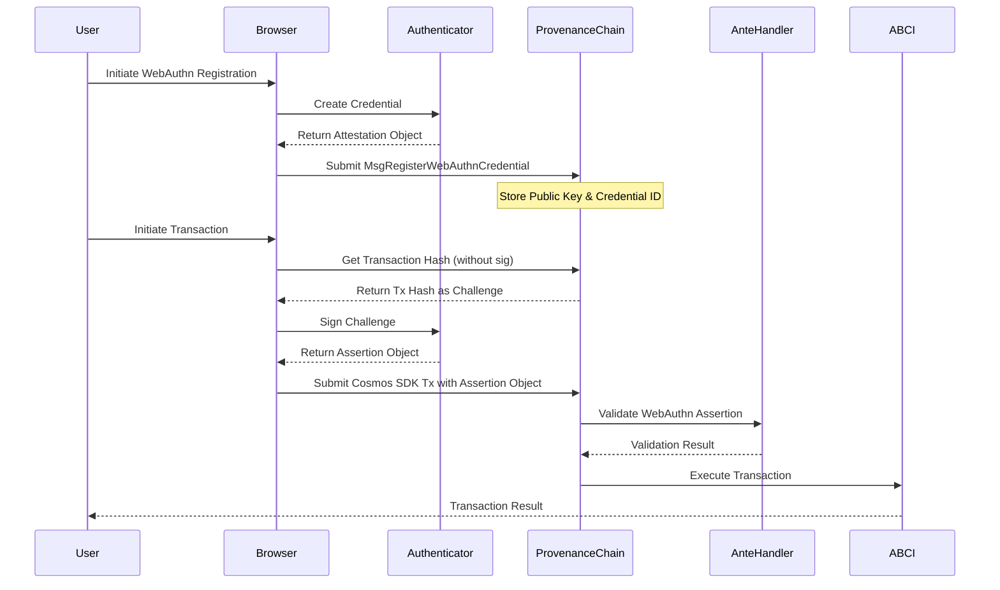

# WebAuthn Client Usage Guidelines

This document is non normative but because clients have such an important part to play in the WebAuthn process, it is important to understand the client side of the process.
Especially in the context of provenance smart accounts on the provenance blockchain.

## Key Usage

Webauthn Spec here https://www.w3.org/TR/webauthn/#sctn-sample-registration
Initially Provenance blockchain will support the following credential types
```js
    // This Relying Party will accept either an ES256(P-256) or EdDSA(Ed255) credential, but
    // prefers an ES256 credential.
            pubKeyCredParams: [
                // P-256
                {alg: -7, type: "public-key" as "public-key"}, // "ES256" as registered in the IANA COSE Algorithms registry
                // Ed255
                {alg: -8, type: "public-key" as "public-key"},
            ]
```

most clients should be able to support these credential types, and for now these are the most common types of credentials that are supported by most common webauthn clients.


## What is the challenge i sign?
1. Signing the SHA-256 of the Messages(same mechanism as getting a TxHash)
   This means hashing only the msgs (i.e., the message content of the Cosmos transaction) and signing that.

✅ Pros:
Fine-grained control: The user signs exactly what they intend to send, making it clear what is being authorized.
Replay prevention (if nonce included in msgs): If you include a nonce (like account_sequence), it prevents signature reuse.
Better compatibility with multi-signature schemes: Other signers can independently sign the same message hash.
❌ Cons:
Doesn't cover all transaction metadata: Since the full Tx structure includes gas fees, memo, etc., an attacker might modify those fields without invalidating the signature.
Replay risk across chains: If the same msgs are broadcasted on multiple Cosmos chains (e.g., different fee parameters), a signature could be reused.
Validation complexity: Validators need to reconstruct the signed hash exactly, ensuring no modifications.
2. Signing the TxHash as Challenge
   This means signing the txhash, which is the full transaction including all metadata.

✅ Pros:
Stronger integrity: The signature ensures the entire transaction is exactly what the user approved (including gas fees, memos, and other metadata).
More resilient to tampering: Attackers cannot modify any field of the transaction without invalidating the signature.
Better replay protection: Since the txhash depends on chain ID, sequence number, and fee, the same signature won’t be valid across different transactions.
❌ Cons:
Less flexibility: If even a small part of the transaction changes (e.g., fee amount or gas price), the signature becomes invalid, requiring the user to re-sign.
Higher UX friction: Users may need to approve transactions more often due to small fee adjustments or re-broadcast attempts.
Potential incompatibility with partial signing: If multiple signers are involved, the txhash must be fully constructed before signing, which can be inconvenient.





How do i register a credential?

A parsed registration example is here 
```json
{
	"id":"6xrtBhJQW6QU4tOaB4rrHaS2Ks0yDDL_q8jDC16DEjZ-VLVf4kCRkvl2xp2D71sTPYns-exsHQHTy3G-zJRK8g",
	"rawId":"6xrtBhJQW6QU4tOaB4rrHaS2Ks0yDDL_q8jDC16DEjZ-VLVf4kCRkvl2xp2D71sTPYns-exsHQHTy3G-zJRK8g",
	"type":"public-key",
	"authenticatorAttachment":"platform",
	"clientExtensionResults":{
		"appid":true
	},
	"response":{
		"attestationObject":"o2NmbXRkbm9uZWdhdHRTdG10oGhhdXRoRGF0YVjEdKbqkhPJnC90siSSsyDPQCYqlMGpUKA5fyklC2CEHvBBAAAAAAAAAAAAAAAAAAAAAAAAAAAAQOsa7QYSUFukFOLTmgeK6x2ktirNMgwy_6vIwwtegxI2flS1X-JAkZL5dsadg-9bEz2J7PnsbB0B08txvsyUSvKlAQIDJiABIVggLKF5xS0_BntttUIrm2Z2tgZ4uQDwllbdIfrrBMABCNciWCDHwin8Zdkr56iSIh0MrB5qZiEzYLQpEOREhMUkY6q4Vw",
		"clientDataJSON":"eyJjaGFsbGVuZ2UiOiJXOEd6RlU4cEdqaG9SYldyTERsYW1BZnFfeTRTMUNaRzFWdW9lUkxBUnJFIiwib3JpZ2luIjoiaHR0cHM6Ly93ZWJhdXRobi5pbyIsInR5cGUiOiJ3ZWJhdXRobi5jcmVhdGUifQ",
		"transports":["usb","nfc","fake"]
	}
}
```
an example of how to generate the attestation is shown here  https://github.com/arnabmitra/webauthn_proxy/blob/d2e97373461b1533f6aba067f92095a26be5d143/main.go#L716


the golang implementation objects are shown here 
```go
type Attestation struct {
	ID                      string              `json:"id"`
	RawID                   string              `json:"rawId"`
	Response                AttestationResponse `json:"response"`
	Type                    string              `json:"type"`
	AuthenticatorAttachment string              `json:"authenticatorAttachment,omitempty"`
}

type AttestationResponse struct {
	AttestationObject string `json:"attestationObject"`
	ClientDataJSON    string `json:"clientDataJSON"`
}

```

this is the browser side code 
```js
let registerUser = () => {
    let username = $('#username').val();

    if (username === '') {
        errorMessage('Please enter a valid username');
	    return;
    }

	$.get(
        '/webauthn/register/get_credential_creation_options?username=' + encodeURIComponent(username),
        null,
        data => data,
        'json')
        .then(credCreateOptions => {
            credCreateOptions.publicKey.challenge = bufferDecode(credCreateOptions.publicKey.challenge);
            credCreateOptions.publicKey.user.id = bufferDecode(credCreateOptions.publicKey.user.id);
            if (credCreateOptions.publicKey.excludeCredentials) {
                for (cred of credCreateOptions.publicKey.excludeCredentials) {
                    cred.id = bufferDecode(cred.id);
                }
            }
            console.log('AuthenticatorSelection:', credCreateOptions.publicKey.authenticatorSelection);
            return navigator.credentials.create({
                publicKey: credCreateOptions.publicKey
            });
        })
        .then(cred => {
            console.log('Credential:', cred); // Log the whole cred object
            return $.post(
                '/webauthn/register/process_registration_attestation?username=' + encodeURIComponent(username),
                formatFinishRegParams(cred),
                data => data,
                'json'
            );
        })
        .then(success => {
            successMessage(success.Message);
            preformattedMessage(success.Data);
        })
        .catch(error => {
            if(error.hasOwnProperty("responseJSON")){
                errorMessage(error.responseJSON.Message);
            } else {
                errorMessage(error);
            }
        });
};


```

you can find an example of how to register with provenance here (https://github.com/provenance-io/provenance-priv/blob/897a45fe0df9af5cc86b9a7128ce40673ce7264e/app/temp_test_util/register_credential.go#L32)
```go
package main

import (
	"context"
	"crypto/sha256"
	"encoding/hex"
	"fmt"
	"github.com/cosmos/cosmos-sdk/client/tx"
	cryptotypes "github.com/cosmos/cosmos-sdk/crypto/types"
	sdk "github.com/cosmos/cosmos-sdk/types"
	testutilmod "github.com/cosmos/cosmos-sdk/types/module/testutil"
	txservice "github.com/cosmos/cosmos-sdk/types/tx"
	"github.com/cosmos/cosmos-sdk/types/tx/signing"
	"github.com/cosmos/cosmos-sdk/x/auth"
	xauthsigning "github.com/cosmos/cosmos-sdk/x/auth/signing"
	"github.com/cosmos/cosmos-sdk/x/bank"
	"github.com/provenance-io/provenance/app/temp_test_util/temp_util"
	smartaccountmodule "github.com/provenance-io/provenance/x/smartaccounts/module"
	"github.com/provenance-io/provenance/x/smartaccounts/types"
	"google.golang.org/grpc"
	"log"
	"strings"
)

func init() {
	// Set the Bech32 prefix to "tp"
	config := sdk.GetConfig()
	config.SetBech32PrefixForAccount("tp", "tp"+sdk.PrefixPublic)
	config.Seal()
}

func broadcastTx() error {
	// Choose your codec: Amino or Protobuf. Here, we use Protobuf, given by the following function.
	encCfg := testutilmod.MakeTestEncodingConfig(bank.AppModuleBasic{}, auth.AppModuleBasic{}, smartaccountmodule.AppModuleBasic{})

	// Create a new TxBuilder.
	txBuilder := encCfg.TxConfig.NewTxBuilder()
	// this is just a test account, for local testing
	privKey, _ := temp_util.PrivKeyFromHex("f109a351d02607503221102905585f29c01dce1e9fb8a3afcb352f357021d2d7")
	pub := privKey.PubKey()
	addr := sdk.AccAddress(pub.Address())
	fmt.Printf("the from address is %s\n", addr)

	// Create the MsgRegisterWebAuthnCredential message
	msg := &types.MsgRegisterWebAuthnCredential{
		Sender: addr.String(),
		//EncodedAttestation: base64.RawURLEncoding.EncodeToString([]byte("{\n    \"id\": \"Gz00W_zksO57m_OEUJTU7w\",\n    \"type\": \"public-key\",\n    \"rawId\": \"Gz00W_zksO57m_OEUJTU7w\",\n    \"response\": {\n      \"clientDataJSON\": \"eyJ0eXBlIjoid2ViYXV0aG4uY3JlYXRlIiwiY2hhbGxlbmdlIjoid3FWR0JBSWpZNVFYUDdBR1llQ1kzX3pnckdnT3NtSzdoSnB5cWV6Q013USIsIm9yaWdpbiI6Imh0dHA6Ly9sb2NhbGhvc3Q6MTgwODAiLCJjcm9zc09yaWdpbiI6ZmFsc2V9\",\n      \"attestationObject\": \"o2NmbXRkbm9uZWdhdHRTdG10oGhhdXRoRGF0YViUSZYN5YgOjGh0NBcPZHZgW4_krrmihjLHmVzzuoMdl2NdAAAAAOqbjWZNAR0hPOS2tIy1ddQAEBs9NFv85LDue5vzhFCU1O-lAQIDJiABIVggbHZkjgkGjkTk6JysH7nu5zwXmZ2EsdGzb264iJgTdSEiWCBuc3qtdr_qAooTr-LsQFdNnenDerECglHPHaF91-GJNQ\"\n    }\n  }")),
		EncodedAttestation: "eyJpZCI6ImJiY1h1S3MxTWFYb3ZaYkxIWEljX1EiLCJyYXdJZCI6ImJiY1h1S3MxTWFYb3ZaYkxIWEljX1EiLCJyZXNwb25zZSI6eyJhdHRlc3RhdGlvbk9iamVjdCI6Im8yTm1iWFJrYm05dVpXZGhkSFJUZEcxMG9HaGhkWFJvUkdGMFlWaVVTWllONVlnT2pHaDBOQmNQWkhaZ1c0X2tycm1paGpMSG1Wenp1b01kbDJOZEFBQUFBT3FialdaTkFSMGhQT1MydEl5MWRkUUFFRzIzRjdpck5UR2w2TDJXeXgxeUhQMmxBUUlESmlBQklWZ2doNUpKTTZQNVpPTm82OFFNbnUybVQzQnBnYUtOUlJERGZkRVpDOEQwclo0aVdDQkR1M2tZUGM3a0o2QnVLTmdvQXMzZjVLdkVWZ0pTZG1LTDJpU1k0cy1pWHciLCJjbGllbnREYXRhSlNPTiI6ImV5SjBlWEJsSWpvaWQyVmlZWFYwYUc0dVkzSmxZWFJsSWl3aVkyaGhiR3hsYm1kbElqb2lUMmhuYWt4cGVEUk9ZV2xGWTJaelIxQnNTMG80Y0RSVFZuQjVhV05WTlZwWlEyeHZjemR1ZG1keVl5SXNJbTl5YVdkcGJpSTZJbWgwZEhBNkx5OXNiMk5oYkdodmMzUTZNVGd3T0RBaWZRIn0sInR5cGUiOiJwdWJsaWMta2V5IiwiYXV0aGVudGljYXRvckF0dGFjaG1lbnQiOiJwbGF0Zm9ybSJ9",
		UserIdentifier:     "example_username",
	}

	err := txBuilder.SetMsgs(msg)
	if err != nil {
		return err
	}

	// Create a connection to the gRPC server.
	grpcConn, _ := grpc.Dial(
		"127.0.0.1:9090",    // Or your gRPC server address.
		grpc.WithInsecure(), // The Cosmos SDK doesn't support any transport security mechanism.
	)
	defer grpcConn.Close()

	txBuilder.SetGasLimit(2000000)
	txBuilder.SetFeeAmount(sdk.NewCoins(sdk.NewInt64Coin("nhash", 38400000000)))
	// Get account number and sequence dynamically
	accNum, accSeq, err := temp_util.GetAccountInfo(grpcConn, addr, encCfg.Codec)
	if err != nil {
		return err
	}

	privs := []cryptotypes.PrivKey{privKey}
	accNums := []uint64{accNum}
	accSeqs := []uint64{accSeq}

	var sigsV2 []signing.SignatureV2
	for i, priv := range privs {
		sigV2 := signing.SignatureV2{
			PubKey: priv.PubKey(),
			Data: &signing.SingleSignatureData{
				SignMode:  signing.SignMode_SIGN_MODE_DIRECT,
				Signature: nil,
			},
			Sequence: accSeqs[i],
		}

		sigsV2 = append(sigsV2, sigV2)
	}
	err = txBuilder.SetSignatures(sigsV2...)
	if err != nil {
		return err
	}

	txBytes1, err := encCfg.TxConfig.TxEncoder()(txBuilder.GetTx())
	if err != nil {
		return err
	}

	// Compute the SHA-256 hash of the raw bytes.
	hash := sha256.Sum256(txBytes1)
	txHash := strings.ToUpper(hex.EncodeToString(hash[:]))

	fmt.Printf("Transaction Hash: %s\n", txHash)

	// Second round: all signer infos are set, so each signer can sign.
	sigsV2 = []signing.SignatureV2{}
	for i, priv := range privs {
		signerData := xauthsigning.SignerData{
			ChainID:       "testing",
			AccountNumber: accNums[i],
			Sequence:      accSeqs[i],
		}
		sigV2, err := tx.SignWithPrivKey(context.TODO(),
			signing.SignMode_SIGN_MODE_DIRECT, signerData,
			txBuilder, priv, encCfg.TxConfig, accSeqs[i])
		if err != nil {
			return err
		}

		sigsV2 = append(sigsV2, sigV2)
	}
	err = txBuilder.SetSignatures(sigsV2...)

	// Generated Protobuf-encoded bytes.
	txBytes, err := encCfg.TxConfig.TxEncoder()(txBuilder.GetTx())
	if err != nil {
		return err
	}
	// Compute the SHA-256 hash of the raw bytes.
	hashFinal := sha256.Sum256(txBytes)
	txHashFinal := strings.ToUpper(hex.EncodeToString(hashFinal[:]))
	fmt.Printf("Transaction Hash: %s\n", txHashFinal)

	// Generate a JSON string.
	txJSONBytes, err := encCfg.TxConfig.TxJSONEncoder()(txBuilder.GetTx())
	if err != nil {
		return err
	}
	txJSON := string(txJSONBytes)
	fmt.Printf("the txJSON is %s\n", txJSON)

	// Broadcast the tx via gRPC. We create a new client for the Protobuf Tx service.
	clientCtx := context.Background()
	txSvcClient := txservice.NewServiceClient(grpcConn)
	grpcRes, err := txSvcClient.BroadcastTx(
		clientCtx,
		&txservice.BroadcastTxRequest{
			Mode:    txservice.BroadcastMode_BROADCAST_MODE_SYNC,
			TxBytes: txBytes, // Proto-binary of the signed transaction, see previous step.
		},
	)
	if err != nil {
		return err
	}

	fmt.Println(grpcRes.TxResponse.Code) // Should be `0` if the tx is successful
	fmt.Printf("the tx hash is %s\n", grpcRes.TxResponse.TxHash)
	return nil
}

func main() {
	err := broadcastTx()
	if err != nil {
		log.Fatalf("failed to broadcast transaction: %v", err)
	}
}


```


## How does the attestation object look like?

Sample attestation object 

```json
{
  "id": "bbcXuKs1MaXovZbLHXIc_Q",
  "type": "public-key",
  "rawId": "bbcXuKs1MaXovZbLHXIc_Q",
  "response": {
    "clientDataJSON": "eyJ0eXBlIjoid2ViYXV0aG4uZ2V0IiwiY2hhbGxlbmdlIjoiTmpoQ1JrVkZRakZCUWpsQ1FUTTJPVGt4TmtZNU5FTkJNVGM1UVRVM1FrSTVPREF4UXpZMFJVRTBNVUUxTWpSRk9ESTNRak00T1VSRE5EZzFNall3T0EiLCJvcmlnaW4iOiJodHRwOi8vbG9jYWxob3N0OjE4MDgwIiwiY3Jvc3NPcmlnaW4iOmZhbHNlLCJvdGhlcl9rZXlzX2Nhbl9iZV9hZGRlZF9oZXJlIjoiZG8gbm90IGNvbXBhcmUgY2xpZW50RGF0YUpTT04gYWdhaW5zdCBhIHRlbXBsYXRlLiBTZWUgaHR0cHM6Ly9nb28uZ2wveWFiUGV4In0",
    "authenticatorData": "SZYN5YgOjGh0NBcPZHZgW4_krrmihjLHmVzzuoMdl2MdAAAAAA",
    "signature": "MEUCIQDZ7WIksZyQYIODa6o8nkPg5Tamh1psEHnQAgPoSw9MJgIgLbEtPzzBIvafT8icnxSexzXfOVvrS1v_AJXgoDrZJis",
    "userHandle": "6-SG3dq4hPbuAQ"
  }
}
```

if you wanted to see if your assertion works locally you can use the following code 

```go
// retrieve the user credentials
func init() {
	config := sdk.GetConfig()
	config.SetBech32PrefixForAccount("tp", "tp"+sdk.PrefixPublic)
	config.Seal()
}

func querySmartAccount(address string) (*types.ProvenanceAccount, error) {
	// Create gRPC connection
	grpcConn, err := grpc.Dial(
		"127.0.0.1:9090",
		grpc.WithInsecure(),
	)
	if err != nil {
		return nil, err
	}
	defer grpcConn.Close()

	// Create query client
	queryClient := types.NewQueryClient(grpcConn)

	// Create the query request
	req := &types.AccountQueryRequest{
		Address: address,
	}

	// Execute the query
	resp, err := queryClient.SmartAccount(
		context.Background(),
		req,
	)
	if err != nil {
		return nil, err
	}

	// Print the response
	fmt.Printf("Credential for address %s:\n", resp.Provenanceaccount.Address)
	fmt.Printf("UserIdentifier: %d\n", resp.Provenanceaccount.SmartAccountNumber)
	fmt.Printf("Credentials registered size: %d\n", len(resp.Provenanceaccount.Credentials))
	fmt.Printf("Account object: %v\n", resp.Provenanceaccount)

	return resp.Provenanceaccount, nil
}

func main() {
	address := "tp1w40q3q7v26petw6g5stz5dt9xsezgnzalxgw8x" // Replace with the smart account address you want to query
	provenanceAccount, err := querySmartAccount(address)
	if err != nil {
		fmt.Printf("Error querying smart account: %v\n", err)
	}

	// verify the attestation from the retrieved credentials
	for _, credential := range provenanceAccount.Credentials {
		fmt.Printf("Credential ID: %s\n", credential.Id)
		fmt.Printf("Credential Number: %d\n", credential.CredentialNumber)
		fmt.Printf("Credential Public Key: %s\n", credential.PublicKey)
		// change rpOrigin
		fmt.Printf("Credential Public Key: %s\n", credential.RpId)

		assertionResponse := `
{
  "id": "bbcXuKs1MaXovZbLHXIc_Q",
  "type": "public-key",
  "rawId": "bbcXuKs1MaXovZbLHXIc_Q",
  "response": {
    "clientDataJSON": "eyJ0eXBlIjoid2ViYXV0aG4uZ2V0IiwiY2hhbGxlbmdlIjoiTmpoQ1JrVkZRakZCUWpsQ1FUTTJPVGt4TmtZNU5FTkJNVGM1UVRVM1FrSTVPREF4UXpZMFJVRTBNVUUxTWpSRk9ESTNRak00T1VSRE5EZzFNall3T0EiLCJvcmlnaW4iOiJodHRwOi8vbG9jYWxob3N0OjE4MDgwIiwiY3Jvc3NPcmlnaW4iOmZhbHNlLCJvdGhlcl9rZXlzX2Nhbl9iZV9hZGRlZF9oZXJlIjoiZG8gbm90IGNvbXBhcmUgY2xpZW50RGF0YUpTT04gYWdhaW5zdCBhIHRlbXBsYXRlLiBTZWUgaHR0cHM6Ly9nb28uZ2wveWFiUGV4In0",
    "authenticatorData": "SZYN5YgOjGh0NBcPZHZgW4_krrmihjLHmVzzuoMdl2MdAAAAAA",
    "signature": "MEUCIQDZ7WIksZyQYIODa6o8nkPg5Tamh1psEHnQAgPoSw9MJgIgLbEtPzzBIvafT8icnxSexzXfOVvrS1v_AJXgoDrZJis",
    "userHandle": "6-SG3dq4hPbuAQ"
  }
}
`
		bodyAssertion := io.NopCloser(bytes.NewReader([]byte(assertionResponse)))
		par, err := protocol.ParseCredentialRequestResponseBody(bodyAssertion)
		if err != nil {
			log.Fatalf("Failed to parse credential request response: %v", err)
		}

		// Step 5. Let JSONtext be the result of running UTF-8 decode on the value of cData.
		// We don't call it cData but this is Step 5 in the spec.
		if err = json.Unmarshal(par.Raw.AssertionResponse.ClientDataJSON, &par.Response.CollectedClientData); err != nil {
			log.Fatalf("Failed to unmarshal client data JSON: %v", err)
		}
		challenge := base64.RawURLEncoding.EncodeToString([]byte("68BFEEB1AB9BA369916F94CA179A57BB9801C64EA41A524E827B389DC4852608"))
		fmt.Printf("Challenge: %s\n", challenge)
		sigVerificationResult := credential.VerifySignature([]byte(challenge), *par)
		if sigVerificationResult {
			fmt.Printf("Signature verified for credential ID: %s\n", credential.Id)
		} else {
			fmt.Printf("Signature verification failed for credential ID: %s\n", credential.Id)
		}
	}
}
```
